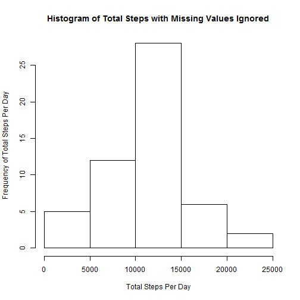
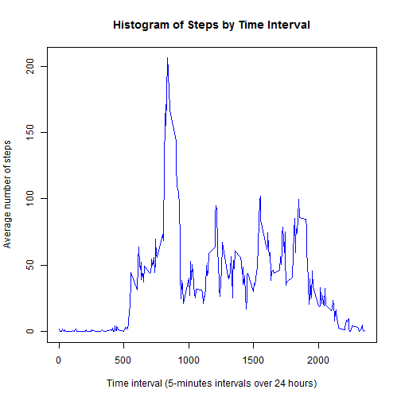
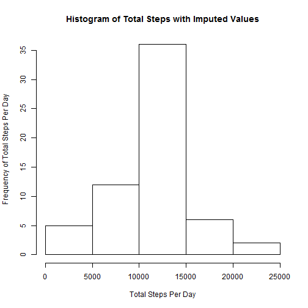
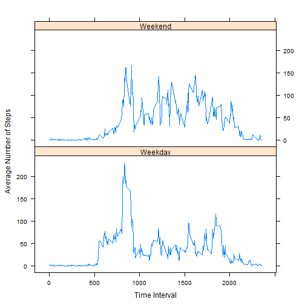

---
title: "Reproducible Research PA1"
author: "thenumbersman"
date: "January 14, 2015"
output: html_document
---     

## Reproducible Research: Peer Assessment 1

### Loading and preprocessing the data


```r
download.file("http://d396qusza40orc.cloudfront.net/repdata%2Fdata%2Factivity.zip", destfile="activity.zip", mode="wb")
afile <- unzip("activity.zip")
classes <- c("numeric", "Date", "numeric") # set classes
ad <- read.csv(afile, colClasses=classes, na.strings="NA") # read activity data (ad)
```
### What is mean total number of steps taken per day?


```r
adcc <- ad[complete.cases(ad),] # ignore missing cases
totsteps <- tapply(adcc$steps, adcc$date, sum)
hist(totsteps,
    main="Histogram of Total Steps with Missing Values Ignored",
    xlab="Total Steps Per Day", 
    ylab= "Frequency of Total Steps Per Day")
```

 

```r
tsmean <- mean(totsteps)
tsmedian <- median(totsteps)
tsmean <- format(tsmean, digits=7)
tsmedian <- format(tsmedian, digits=7)
```

The mean total steps is 10766.19.   
The median total steps is 10765.   


### What is the average daily activity pattern? See Histogram below.


```r
avg <- aggregate(adcc$steps, by = list(interval=adcc$interval), FUN=mean)
plot(avg$interval, avg$x, type = "l", col="blue",
     main = "Histogram of Steps by Time Interval",
     xlab="Time interval (5-minutes intervals over 24 hours)",
     ylab="Average number of steps")
```

 

```r
maxinterval <- avg$interval[which.max(avg$x)]
```

The 5-minute interval that contains the maximum number of steps is 835.


### Imputing missing values using the mean of the 5-minute interval strategy


```r
nmv <- nrow(ad)- sum(complete.cases(ad))
```

The total number of missing values in the data set is 2304.


```r
ncc <- ad[!complete.cases(ad),] # create dataset of missing value observations
nintervals <- 24 * 60 / 5 #hours per day  * minutes per hour/ minutes per interval
ndays <- nrow(ncc)/nintervals
index=0
for(i in 1:ndays)
{    
    for(j in 1:nintervals)
    {
        ncc$steps[j + index] <- avg$x[j] #assign mean of 5-minute interval to missing values
    }
    index = index + nintervals 
} 
```


```r
cad <- rbind(adcc, ncc) #combine completed cases and imputed cases
cad <- cad[order(cad$date, cad$interval),] # sort new dataset by date and interval within date
```


```r
ctotsteps <- tapply(cad$steps, cad$date, sum)
hist(ctotsteps,
     main="Histogram of Total Steps with Imputed Values",
     xlab="Total Steps Per Day", 
     ylab= "Frequency of Total Steps Per Day")
```

 

```r
ctsmean <- mean(ctotsteps)
ctsmedian <- median(ctotsteps)
difmeans <- ctsmean - as.numeric(tsmean)
difmedians <- ctsmedian - as.numeric(tsmedian)
ctsmean <- format(ctsmean, digits=7)
ctsmedian <- format(ctsmedian, digits=7)
```

The mean total steps is 10766.19.   
The median total steps is 10766.19.

There is no significant difference between the values of mean and median calculated above:

The difference between means is -0.0013.     
The difference between medians is 1.1887.

By comparing the two histograms, you can see the impact of imputing missing data on the estimates
of the total daily number of steps: In the bin 10000 - 15000, the frequency of total steps per day
increased from 28 to 36, while the freqency in the other bins stayed the same.


### Are there differences in activity patterns between weekdays and weekends?


```r
day <- weekdays(cad$date)
for(i in 1:nrow(cad))
{    
    if(day[i] %in% c("Saturday","Sunday")) day[i]="Weekend" else day[i]="Weekday"
}
aday <- cbind(cad, day)
```

```r
suppressPackageStartupMessages(library(latticeExtra))
avg <- aggregate(aday$steps, by = list(interval=aday$interval, aday$day), FUN=mean) 
xyplot(avg$x ~ avg$interval | avg$Group.2, data =avg, layout=c(1,2), type="l",
       xlab="Time Interval",
       ylab="Average Number of Steps")
```

 

The plots of the activity patterns do depict differences. Although the average number of steps
are much higher early in the day for the weekday, there is a percipitous drop in the average 
and it never comes anywhere near its initial peak. The average number of steps is also high early
in the day for the weekend (although not as high as weekday). The average number of steps also
decreases percipitously, however, it increases multiple times throughout the day, nearly reaching
its initial peak.
